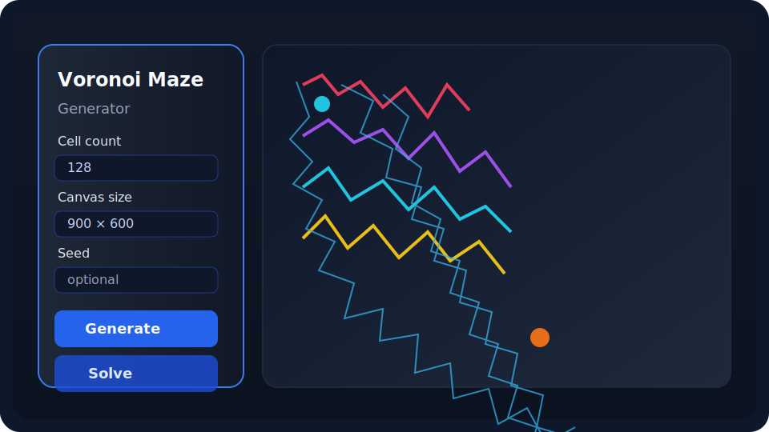

# Voronoi Maze Generator

A modern single-page Voronoi maze generator that uses D3's Delaunay/Voronoi utilities to create organic-looking tilings and then carves a perfect maze via Kruskal's algorithm.

## Features

- Adjustable maze structure (cell count, canvas size, Lloyd relaxation, passage width)
- Deterministic generation via optional random seed input
- Rich styling controls for cell outlines, fills, markers, and background colors
- Animated breadth-first search solver with smooth spline rendering
- Responsive layout with debounced UI updates and device-pixel-aware canvas drawing
- One-click PNG export of the current maze view

## Installation

The generator runs entirely in the browser, so no build tooling is required. You can either
open the static files directly or serve them from a lightweight HTTP server for features like
deterministic asset loading and easier mobile testing.

### Quick Start

1. Clone or download this repository.
2. Serve the directory or open `index.html` directly in a modern browser.

### Recommended: run a local static server

Running through a local server avoids browser security restrictions around file URLs and makes
it easy to test on other devices on your network. A few options:

- **Python 3**
  ```bash
  cd Voronoi_Maze_Generator
  python3 -m http.server 8000
  ```
  Then visit <http://localhost:8000/> in your browser.
- **Node.js** (if installed)
  ```bash
  npx serve .
  ```

## Getting Started

1. Load the app following the installation instructions above.
2. Tune the controls in the left panel and click **Generate New Maze** to rebuild the maze.
3. Optionally enter a seed value to reproduce a maze deterministically.
4. Click **Solve Maze** to animate the path from the automatically selected start/end points.

No build step is required—the project is entirely static.

## Preview



> _Illustrated preview rendered as SVG so it remains text-based and PR-friendly. The live app mirrors this layout and styling._

## Project Structure

```
index.html        # Application markup and control layout
styles/main.css   # Visual styling for the page and controls
scripts/main.js   # Maze generation, solving, and drawing logic
```

## Attribution

Voronoi diagram computations are powered by [D3.js](https://d3js.org/).
